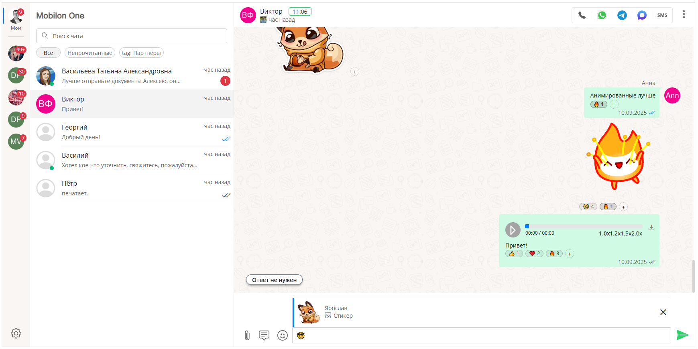

# Chotto UI

🚀 **Vue 3 UI библиотека компонентов для создания современных чат-интерфейсов и AI-ассистентов**

[](https://vuejs.org/)
[](https://www.typescriptlang.org/)
[](LICENSE)

## 📖 Документация и ресурсы

- 📚 **[Документация](https://mobilon-dev.github.io/chotto-docs/)** - Полное руководство по использованию
- 🎨 **[Storybook](https://mobilon-dev.github.io/chotto/)** - Интерактивные примеры 20+ компонентов
- 🎯 **[Демо-приложения](https://mobilon-dev.github.io/chotto-demo/)** - 10 готовых примеров использования
- 💬 **[Telegram чат разработчиков](https://t.me/chottodev)** - Сообщество и поддержка

## 🖼️ Скриншоты



## 🎥 Видео-обзоры

- [Chotto 01: Welcome](https://youtu.be/LbtXeR_P9fs) - Введение в библиотеку
- [Chotto 02: WABA templates](https://youtu.be/bwhcn6KAn28) - Работа с шаблонами WABA

## ✨ Возможности

### 🎨 **Богатый набор компонентов**
- **20+ готовых компонентов** для создания чат-интерфейсов
- **Модульная архитектура** - используйте только нужные компоненты
- **TypeScript поддержка** - полная типизация всех компонентов

### 💬 **Множественные типы сообщений**
- 📝 Текстовые сообщения с поддержкой Markdown
- 🖼️ Изображения с превью и галереей
- 🎵 Аудио сообщения с плеером
- 🎬 Видео сообщения с встроенным плеером
- 📎 Файлы с превью и загрузкой
- 📞 Звонки с транскрипцией
- 🎭 Стикеры (включая анимированные)
- 💬 Ответы на сообщения
- 😊 Эмодзи-реакции на сообщения
- 📅 Разделители дат
- ⚙️ Системные уведомления
- ⌨️ Индикатор печати

### 🎯 **Продвинутые функции**
- 🔍 **Поиск по сообщениям** с подсветкой результатов
- 📱 **Адаптивные макеты** для всех устройств
- 🎨 **3 готовые темы**: светлая, темная, зеленая
- 🌍 **Многоязычность**: русский и английский
- 🔔 **Система уведомлений** в реальном времени
- 📊 **Просмотры сообщений** с счетчиками
- 🔗 **Предпросмотр ссылок** с метаданными
- 🎵 **Встроенные медиаплееры** (YouTube, Яндекс.Музыка, Rutube, VK)
- ⌨️ **Клавиатуры быстрых ответов**
- 📝 **Шаблоны сообщений** (WABA, групповые)
- 🎤 **Запись аудио и видео**
- 😊 **Поддержка эмодзи**
- ⚙️ **Контекстное меню сообщений** с настраиваемыми действиями
- ✅ **Статусы доставки сообщений** (отправка, доставлено, прочитано, ошибка)
- 💾 **Загрузка медиафайлов** (изображения, видео, аудио)

### 🏗️ **Гибкая архитектура**
- **Layouts** - определяют структуру интерфейса
- **Containers** - высокоуровневые обертки
- **Components** - переиспользуемые UI элементы
- **Messages** - типизированные компоненты сообщений
- **Modals** - диалоговые окна

## 🚀 Быстрый старт

### Установка

```bash
npm install @mobilon-dev/chotto
```

### Базовое использование

```vue
<template>
  <div class="chat-app">
    <BaseContainer height="90vh" width="90vw">
      <ExtendedLayout>
        <!-- Боковая панель -->
        <template #first-col>
          <SideBar :sidebar-items="sidebarItems" />
          <ThemeMode :themes="themes" />
        </template>
        
        <!-- Список чатов -->
        <template #second-col>
          <ChatList 
            :chats="chats" 
            @select="selectChat"
          />
        </template>
        
        <!-- Область чата -->
        <template #third-col>
          <ChatWrapper>
            <ChatInfo :chat="selectedChat" />
            <Feed :objects="messages" />
            <ChatInput @send="sendMessage" />
          </ChatWrapper>
        </template>
      </ExtendedLayout>
    </BaseContainer>
  </div>
</template>

<script setup>
import {
  BaseContainer,
  ExtendedLayout,
  SideBar,
  ChatList,
  ChatWrapper,
  ChatInfo,
  Feed,
  ChatInput,
  ThemeMode
} from '@mobilon-dev/chotto'

// Импорт основных стилей библиотеки
import '@mobilon-dev/chotto/style.css'

// Если нужна конкретная тема, можно импортировать отдельно:
import '@mobilon-dev/chotto/themes/default.css'
import '@mobilon-dev/chotto/themes/dark.css'
import '@mobilon-dev/chotto/themes/green.css'
import '@mobilon-dev/chotto/themes/mobilon1.css'

// Ваша логика...
</script>
```

## 🛠️ Разработка

### Требования
- Node.js 18+
- npm или yarn

### Установка зависимостей
```bash
npm install
```

### Запуск в режиме разработки
```bash
npm run dev
```

### Запуск Storybook
```bash
npm run storybook
```

### Сборка библиотеки
```bash
npm run build
```

### Проверка кода
```bash
npm run lint
npm run lint-fix
```

## 🏗️ Архитектура

```
src/
├── components/                 # UI компоненты (атомарный дизайн)
│   ├── 1_atoms/                # Атомарные компоненты (ButtonContextMenu, ContextMenu, etc.)
│   ├── 1_icons/                # Иконки (AvatarIcon, CheckIcon, etc.)
│   ├── 2_blocks/               # Блочные компоненты (FeedSearch, FeedFoundObjects, etc.)
│   ├── 2_chatinput_elements/   # Элементы ввода (FileUploader, ButtonEmojiPicker, etc.)
│   ├── 2_chatlist_elements/    # Элементы списка чатов (ChatItem, ChatFilter, etc.)
│   ├── 2_elements/             # Общие элементы (ChatInfo, ThemeMode, AudioRecorder, etc.)
│   ├── 2_feed_elements/        # Элементы ленты сообщений (TextMessage, ImageMessage, etc.)
│   ├── 2_modals/               # Модальные окна (Modal, CreateChat, SelectUser, etc.)
│   ├── 3_compounds/            # Составные компоненты (ChatInput, ChatList, Feed, SideBar)
│   ├── 4_layouts/              # Макеты (BaseLayout, ExtendedLayout, AdaptiveExtendedLayout, etc.)
│   └── 5_containers/           # Контейнеры (BaseContainer, FloatContainer)
├── apps/                       # Демо-приложения и примеры использования
│   ├── data/                   # Mock данные для демонстрации
│   ├── stores/                 # Pinia stores
│   ├── stories/                # Storybook истории
│   └── transform/              # Утилиты трансформации данных
├── hooks/                      # Composables (useMessageActions, useTheme, etc.)
│   ├── messages/               # Хуки для работы с сообщениями
│   ├── modals/                 # Хуки для работы с модальными окнами
│   ├── uploadFile/             # Хуки для загрузки файлов
│   └── validators/             # Валидаторы
├── functions/                  # Утилитарные функции
├── types/                      # TypeScript типы и интерфейсы
├── themes/                     # Система тем (default, dark, green, mobilon1)
├── locale/                     # Локализация (EN, RU)
└── utils/                      # Вспомогательные утилиты
```

Дополнительно в корне:

```
.storybook/           # Storybook конфигурация (если используется)
docs/                 # Документация (ARCHITECTURE.md, ARCHITECTURE_ANALYSIS.md, etc.)
scripts/              # Скрипты валидации тем и утилиты
dist/                 # Собранная библиотека (результат сборки)
```

## 🎨 Темы и кастомизация

### Доступные темы
- **Default** - светлая тема
- **Dark** - темная тема  
- **Green** - зеленая тема
- **Mobilon1** - брендовая тема Mobilon

### Импорт тем

Если нужна конкретная тема, можно импортировать отдельно:

```javascript
// Импорт конкретной темы
import '@mobilon-dev/chotto/themes/default.css'
import '@mobilon-dev/chotto/themes/dark.css'
import '@mobilon-dev/chotto/themes/green.css'
import '@mobilon-dev/chotto/themes/mobilon1.css'
```

### Кастомизация CSS переменных

Библиотека использует двухуровневую систему тем:

#### 1. Глобальные переменные темы (`--chotto-theme-*`)

Для кастомизации глобальных переменных используйте атрибут `data-theme`:

```css
[data-theme="default"] {
  /* Основные цвета */
  --chotto-theme-primary-color: #10b981;
  --chotto-theme-secondary-color: #6b7280;
  --chotto-theme-tertiary-color: #f3f4f6;
  
  /* Цвета текста */
  --chotto-theme-primary-text-color: #1e1e1e;
  --chotto-theme-secondary-text-color: #5f5f5f;
  
  /* Типографика */
  --chotto-theme-font-family: 'Inter', sans-serif;
  --chotto-theme-header-font-size: 1.5rem;
  --chotto-theme-text-font-size: 0.875rem;
  
  /* Сообщения */
  --chotto-theme-message-right-bg: #dcf8c6;
  --chotto-theme-message-left-bg: #ffffff;
  
  /* ... и другие переменные (всего 82 переменные) */
}
```

#### 2. Переменные компонентов (`--chotto-componentname-*`)

Каждый компонент имеет свои CSS переменные, которые можно переопределять в вашем проекте. Например, для компонента `CommunicationPanel`:

```css
[data-theme="default"] {
  /* Переменные компонента CommunicationPanel */
  --chotto-communicationpanel-background: #ffffff;
  --chotto-communicationpanel-border-color: #e5e5e5;
  --chotto-communicationpanel-btn-active-color: #007CFF;
  --chotto-communicationpanel-btn-hover-background: #f5f5f5;
  --chotto-communicationpanel-menu-background: #ffffff;
  /* ... и другие переменные компонента */
}
```

**Преимущества:**
- ✅ Гибкая кастомизация отдельных компонентов
- ✅ Все переменные имеют fallback значения
- ✅ Можно использовать глобальные переменные темы: `var(--chotto-theme-primary-color)`
- ✅ Полная типизация через TypeScript интерфейсы

**Доступные значения `data-theme`:** `"default"`, `"dark"`, `"green"`, `"mobilon1"`

Полный список глобальных переменных доступен в типе `ChottoThemeVariables` из `@mobilon-dev/chotto`. Переменные компонентов типизированы в интерфейсах вида `ComponentNameThemeCSSVariables` в соответствующих компонентах.

## 📱 Адаптивность

Библиотека поддерживает адаптивные макеты:
- **Desktop** - 3-колоночный макет
- **Tablet** - 2-колоночный макет  
- **Mobile** - 1-колоночный макет

## 🌍 Локализация

Поддерживаемые языки:
- 🇷🇺 Русский
- 🇺🇸 Английский

```javascript
import { useLocale } from '@mobilon-dev/chotto'

const { t } = useLocale()
console.log(t('component.ChatInput.InputPlaceholder'))
```

## 📦 Типы сообщений

### Текстовые сообщения
```javascript
{
  type: "message.text",
  text: "Привет!",
  position: "left",
  status: "read",
  time: "14:30",
  avatar: "https://example.com/avatar.jpg"
}
```

### Медиа сообщения
```javascript
{
  type: "message.image",
  url: "https://example.com/image.jpg",
  alt: "Описание изображения",
  position: "right",
  status: "sent"
}
```

## 🔌 Интеграция с бэкендом

### Data Provider
```javascript
const dataProvider = {
  getFeed(chatId) {
    // Загрузка сообщений
    return fetch(`/api/chats/${chatId}/messages`)
  },
  addMessage(message) {
    // Отправка сообщения
    return fetch('/api/messages', {
      method: 'POST',
      body: JSON.stringify(message)
    })
  }
}
```

### Event Provider
```javascript
const eventor = {
  push(event) {
    // Обработка событий в реальном времени
    console.log('New event:', event)
  },
  subscribe(callback) {
    // Подписка на события
  }
}
```

## 🤝 Сообщество

### Полезные ссылки
- [Telegram чат](https://t.me/chottodev) - Обсуждения и поддержка
- [Issues](https://github.com/mobilon-dev/chotto/issues) - Баги и предложения
- [Discussions](https://github.com/mobilon-dev/chotto/discussions) - Общие вопросы

### Похожие проекты
- [Sendbird UIKit](https://github.com/sendbird/sendbird-uikit-react)
- [React Chat Elements](https://github.com/detaysoft/react-chat-elements)
- [Vue Advanced Chat](https://github.com/advanced-chat/vue-advanced-chat)
- [Lobe Chat](https://github.com/lobehub/lobe-chat)

## 📄 Лицензия

MIT License - см. файл [LICENSE](LICENSE) для деталей.

## 🙏 Благодарности

Спасибо всем участникам сообщества за вклад в развитие проекта!

---

**Создавайте потрясающие чат-интерфейсы с Chotto UI! 🚀**


